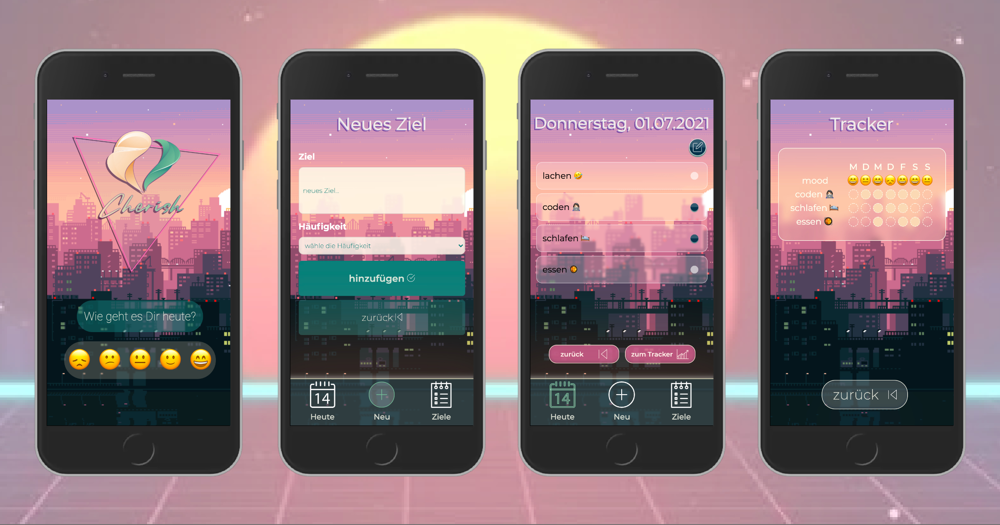

# Cherish

> Digitales Gesellenstück für das neuefische web dev bootcamp

## `Beschreibung`

### Plane Deine Aktivitäten mit Cherish!

Mit dieser innovativen App behältst Du den Überblick über Deine Aktivitäten und Deine Stimmung. Dank des Trackers kannst Du reflektieren, wie Deine Woche verlaufen ist. Cherish hat ein intuitives Design und dient als Reminder, Tracker und Journal.

### `Demo`

### `Browserversion`

Die App findest du auf Vercel: (optimiert für iPhone 6/7/8)
[Demo Version](https://capstone-project-cherish.vercel.app/)

## `Tech Stack`

- Node.js
- React
- React Hooks
- React Router
- PropTypes
- Styled Components
- Styleguidist
- Cypress Tests

## `Project setup`

1. Klone dieses Repository.
2. Installiere alle npm dependencies mit

   `npm install`

3. Um die App im development mode zu sehen tippe npm start, dann öffne http://localhost:3000 im Browser und wähle die mobile Ansicht.

   <!-- # Plan Your activities with Cherish! This innovative app gives You an overview of Your activities and Your mood. Thanks to the tracker You can reflect upon Your week. Cherish has an intuitive design and serves as a reminder, tracker and journal.-->
